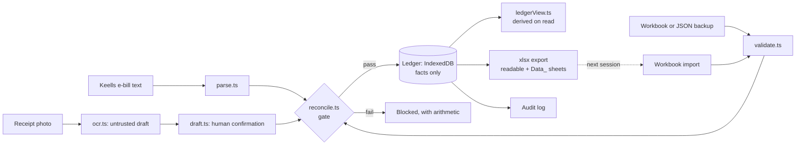

# Grocery bill ledger (Keells · Glomark)

Turns Sri Lankan supermarket bills into a **reconciled ledger**. Every bill must tie out arithmetically before it
is saved; every figure shown is exactly what is printed on a bill. A static site that runs entirely in the
browser, hosted on GitHub Pages.

**Status:** Phase 1 (ingest and reconcile) hardened, plus the workbook export/import loop. The rules engine
(categories, schemes), the analysis views and their workbook sheets are next ([roadmap](docs/requirements.md)).

## The loop

```
add bills ─▶ export workbook (.xlsx) ─▶ keep the file
     ▲                                      │
     └──── import it next time + new bills ◀┘
```

The Excel workbook is your ledger on disk. Import last time's workbook (bills already here are skipped, nothing is
ever overwritten), add the new bills, export again. Importing re-checks every bill, so a file edited by hand cannot
slip a bill that does not add up into the ledger.

## What it does

- **Add a Keells e-bill** — paste the link and the page content; the bill is parsed (both layouts) and checked.
- **Add a photo receipt** — Claude reads the photo(s) into an editable table next to the photo. You confirm every
  figure; **Save stays disabled until every check passes.** Overlapping photos are matched on line number.
- **Reconciliation gate** — items = gross · gross − discount = net · tenders = net · promotions = discount ·
  points = 0.34% of net (Keells) · every line (receipts). Tolerance Rs 0.02, never widened.
- **Idempotent** — bills are keyed on their reference; re-submitting is a no-op.
- **Ledger** — search, filter, sort, stable link per bill, original text/photo kept, audit trail.
- **Workbook** — export to Excel and import it back, losslessly and repeatably; JSON backup as an advanced option; reminder; persistent-storage request.

## Architecture



`src/domain/` is pure TypeScript with no browser dependency (so a backend could reuse it — ADR-0001).
`src/ui/` is React; `src/db/` is the IndexedDB store. The original Python is kept in `keells-bill-analysis/` as
the reference the port is tested against.

## Develop

```bash
npm ci
npm run dev                       # local dev server
npm run verify                    # lint · prettier · types · unit+coverage · traceability · build · bundle budget
npm run build && npm run test:e2e # browser tests: golden paths, axe a11y (light+dark), 360 px, CSP
```

In a sandbox with a pre-installed Chromium: `PW_CHROMIUM_PATH=/path/to/chromium npm run test:e2e`.

## Quality gates (CI)

Lint · Prettier · strict TypeScript · unit tests with coverage thresholds · requirements traceability ·
bundle-size budget · `npm audit` · CodeQL · Playwright e2e incl. axe accessibility on every route.
Deploys happen only from `main` and only after these pass.

## Deploy

Repo **Settings → Pages → Source: GitHub Actions**, then merge to `main`. See `.github/workflows/pages.yml`.

## Photo reading (optional)

Needs your own Anthropic API key (Settings). The key is kept for the browser tab only unless you opt in. Only the
photo is sent, only when you press Read. The model is configurable; default `claude-sonnet-5-5`.

## Known limits (stated, not hidden)

- **Local only.** One browser, one user. No sync, no accounts (ADR-0001). Export regularly.
- **Editing an existing bill in Excel has no effect** — import never overwrites; a differing copy is reported (correcting a bill is US-16, not built).
- **The analysis sheets** (categories, scheme models, capture gap…) are not in the workbook yet; they will be added as extra sheets and old workbooks will keep importing.
- **E-bill content is pasted**, not fetched (ADR-0002). Converting pasted HTML is **unverified** against the live
  digibill page; pasting the visible text always works.
- **Keells totals are a floor** — trips missing from the ledger are not counted. The Capture Gap view arrives in Phase 3.
- The app starts empty and ships no real data; "Load demo data" adds clearly marked fake bills that are never exported (ADR-0007).
- Rules inferred from a small set of real bills are labelled as inferred wherever they appear.

## Documentation

[Requirements & traceability](docs/requirements.md) · [Decisions](docs/adr/) · [Threat model](docs/threat-model.md) ·
[Contributing](CONTRIBUTING.md) · [Security](SECURITY.md) · [Changelog](CHANGELOG.md)
